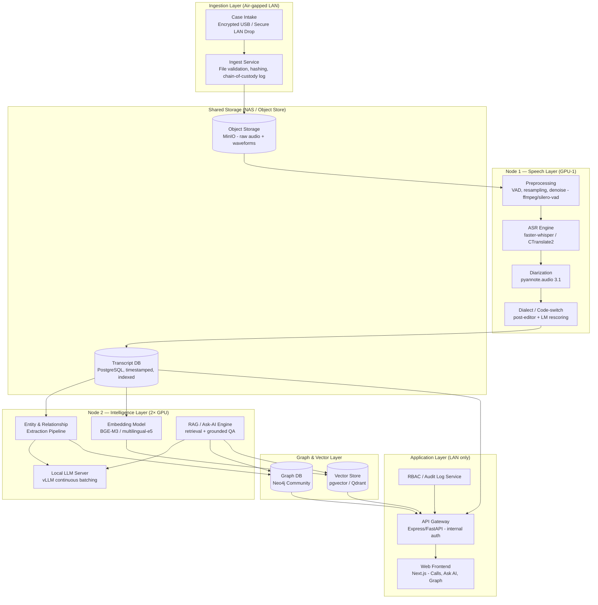

# Project ANUSANDHAN — Local Multilingual Call Intelligence Platform
### Fully On-Premise / Air-Gapped Architecture, Model Selection & Phase-1 Hardware BOM

> Working name: **Anusandhan** (অনুসন্ধান — "investigation"). Rename freely; every reference below is generic enough to find/replace.
>
> **Hard constraint driving every decision in this document:** zero outbound calls to any commercial/cloud API (no OpenAI, Google STT, Azure Speech, AWS Transcribe, Anthropic, etc.). Every model, every service, every line of inference runs inside your own network boundary. This is non-negotiable for law-enforcement/investigative data — it's also what makes the hardware plan below the real bottleneck, not the software.
>
> **Phase-1 design target:** **10 concurrent interactive users** (Ask-AI / transcript review / graph browse) plus a continuous ASR batch queue. Budget ceiling remains **৳30,00,000**.
>
> **Platform split:** **ModelForge** provides ASR + LLM **and** shared data plane services (**Neo4j**, **MinIO**), plus gateway/engine/GPUs/quotas. **Anusandhan** is a separate client app (cases, custody, Ask-AI UX, its own Postgres for domain/jobs) that consumes ModelForge over the LAN. The GPU BoM below is for ModelForge inference nodes — Anusandhan does not host Whisper, vLLM, Neo4j, or MinIO.

---

## 1. High-Level System Architecture

**Everything above the "Application Layer" box sits inside a network segment with no default gateway to the internet.** Only internal DNS/NTP and package-mirror access (during setup, then disabled) is needed.

---

## 2. End-to-End Data Flow

1. **Intake** — audio files (call recordings, cell-tower intercept exports, etc.) are dropped into a watched folder or ingested via encrypted media. Every file is hashed (SHA-256) and logged for chain-of-custody before anything else touches it.
2. **Pre-processing** — silence trimming, voice-activity detection, resampling to 16kHz mono, light denoising.
3. **ASR (transcription)** — batch job pulls from a queue (Redis/RabbitMQ), runs faster-whisper on Node 1's GPU, outputs word-level timestamps.
4. **Diarization** — pyannote.audio assigns speaker turns; merged with ASR output to produce `Speaker A: text [t0–t1]` style transcript segments.
5. **Dialect/code-switch handling** — a lightweight rescoring/post-edit pass (rule-based glossary + LLM cleanup) normalizes Chittagonian/Sylheti/Noakhali tokens against a maintained lexicon, and fixes obvious Bangla–English code-switch mis-segmentation.
6. **Persistence** — final transcript + audio pointer + speaker labels land in PostgreSQL; raw audio stays in object storage (MinIO), never duplicated into the DB.
7. **Entity & relationship extraction** — the local LLM (Node 2) reads transcript batches, extracts persons/locations/orgs/dates/events, resolves nicknames/pronouns using conversational context, and writes nodes/edges into Neo4j.
8. **Embedding & indexing** — transcript chunks are embedded (BGE-M3, which has solid Bangla coverage) and stored in a vector index for retrieval.
9. **Ask-AI (RAG)** — a user question is embedded, relevant transcript chunks + graph neighborhood are retrieved, and the LLM answers **only** from that retrieved context, always returning `call_id, timestamp, speaker` provenance — this is what gives you the evidentiary trail the original KHOJ concept described.
10. **Visualization** — the Next.js frontend renders the relationship graph (person/location/time nodes) and the transcript/Ask-AI panels, pulling from the graph DB and Postgres via the API gateway.
11. **Audit** — every AI-generated answer, every graph edge, and every access event is logged with a source reference for later review.

---

## 3. Core Tech Stack (100% open-weight / self-hostable)

| Layer | Component | Notes |
|---|---|---|
| ASR | **faster-whisper** (CTranslate2 build of Whisper large-v3) | Best available open ASR for Bangla; runs GPU or CPU (int8) |
| Diarization | **pyannote.audio 3.1** | Fully local, PyTorch-based |
| Dialect normalization | Custom lexicon + LLM post-edit pass | Needs a small labeled Chittagonian/Sylheti/Noakhali dataset (reuse internal glossaries where available) |
| LLM serving | **vLLM** (GPU nodes) / **llama.cpp** (CPU demo) | OpenAI-compatible local endpoint; continuous batching required for 10 concurrent users |
| LLM (Ask-AI + extraction) | **Qwen3-30B-A3B-Instruct** (primary) / **Qwen3-32B-Instruct** (quality lane) | See §4 — MoE for concurrent throughput; dense 32B for harder extraction |
| Embeddings | **BAAI/bge-m3** or **intfloat/multilingual-e5-large** | Both handle Bangla acceptably; bge-m3 is stronger on mixed Bangla/English |
| Vector store | **Qdrant** or Postgres + **pgvector** | pgvector keeps the stack simpler if Postgres is already the system of record |
| Graph DB | **Neo4j Community** (**ModelForge-hosted**) | Anusandhan reads/writes via ModelForge LAN endpoints / BOLT — does not run Neo4j itself |
| Transcript store | **PostgreSQL** | Anusandhan domain DB for cases/jobs; ModelForge keeps its own control-plane DB |
| Object storage | **MinIO** (**ModelForge-hosted**) | S3-compatible raw audio + waveforms; Anusandhan stores object keys only |
| Queue/orchestration | **Redis + RQ** or **Celery** | Batch job tracking, progress bars, prioritization |
| API | **FastAPI** or **Express** | Internal-only, JWT/RBAC |
| Frontend | **Next.js** | Calls / Ask-AI / graph UI |
| Auth/RBAC | **Keycloak** (self-hosted) or lightweight custom RBAC | Role-based access per case |

---

## 4. Model Sizing (Qwen3) — Tuned for 10 Concurrent Users

### 4.1 Why Qwen3 (not Qwen2.5)

| Model | Role in Phase 1 | Approx VRAM | Why |
|---|---|---|---|
| **Qwen3-30B-A3B-Instruct** (AWQ / Q4) | **Primary** Ask-AI + light extraction | ~17–20 GB weights + KV | MoE: ~3B active params → **~3–4× token throughput** vs dense 32B at similar VRAM — this is what makes **10 concurrent** Ask-AI sessions realistic on consumer GPUs |
| **Qwen3-32B-Instruct** (AWQ 4-bit) | Quality / heavy entity extraction lane | ~20–22 GB | Best dense open-weight multilingual reasoning that still fits one 24 GB card; use when extraction accuracy matters more than latency |
| **Qwen3-14B-Instruct** (AWQ / Q4) | Fallback if dual high-VRAM cards are unavailable | ~9–12 GB | Fits a 16 GB card; keep as spare lane on Speech Node idle cycles if needed |
| **Qwen3-8B-Instruct** (GGUF Q4_K_M) | CPU / laptop demo only | ~6–7 GB RAM | Live Ask-AI demo after pre-indexing |

**Serving rule for 10 concurrent users:** run **vLLM with continuous batching** (`--max-num-seqs` sized to concurrent Ask-AI), prefer **Qwen3-30B-A3B** on each Intelligence GPU, and keep context windows practical (8k–16k for interactive chat; longer only for offline batch extraction).

### 4.2 Production GPU workload map

| Task | Model | Approx VRAM | Concurrency notes |
|---|---|---|---|
| ASR | `faster-whisper large-v3` (fp16) | ~5–6 GB | Queue-backed; 10 users rarely all transcribe at once — one strong ASR GPU + Redis workers is enough for Phase 1 |
| Diarization | `pyannote/speaker-diarization-3.1` | ~2–3 GB | Same card as ASR; serialize with ASR or alternate via job types |
| Ask-AI (interactive) | `Qwen3-30B-A3B-Instruct` AWQ | ~18–22 GB incl. KV for multi-seq | Target **≥10 concurrent sequences** across **two** vLLM instances (one per Intelligence GPU) |
| Extraction (batch) | `Qwen3-32B-Instruct` AWQ *or* A3B | ~20–22 GB | Offline / lower priority than interactive Ask-AI; schedule when Ask-AI load is low |
| Embeddings | `bge-m3` | ~2 GB | CPU or idle GPU cycles |

At Phase-1 scale, **interactive LLM concurrency** is the bottleneck you must buy for; ASR scales later by adding another Speech worker.

### 4.3 CPU-only demo (no GPU)

| Task | Model | Notes |
|---|---|---|
| ASR | `faster-whisper small` / `medium`, int8 | Pre-run overnight for demos |
| LLM | `Qwen3-8B-Instruct` GGUF Q4_K_M via llama.cpp | Fine for live Ask-AI on a pre-indexed case |
| Embeddings | Multilingual small e5 / bge-small | Keep light |

**Demo strategy:** pre-transcribe and pre-index 10–20 calls; demo only Ask-AI / graph, not live ASR.

---

## 5. Phase 1 Capacity Assumptions

| Metric | Phase-1 target |
|---|---|
| Concurrent interactive users | **10** (Ask-AI, transcript UI, graph) |
| Concurrent ASR uploads | Burst OK via queue; sustained ~2–4 jobs on one Speech GPU |
| Budget ceiling | **৳30,00,000** |
| Network | Air-gapped LAN only |
| Evidence retention | NAS RAID + UPS mandatory |

Prices below are **planning figures for Bangladesh retail (Star Tech / UCC / TechLand / Four Star IT — Aug 2026), before VAT/negotiated discounts.** GPU SKUs and street prices move fast — **re-quote at order time**. RTX 4090 new stock is scarce; RTX 5090 32 GB is widely listed but brand/tier pricing spans roughly ৳4.5L–৳7L+.

---

## 6. Final Phase-1 Hardware BoM (Recommended)

**Decision:** keep the **two-node split** (Speech vs Intelligence), but **upgrade the Intelligence node to dual GPUs** so 10 concurrent Ask-AI sessions stay responsive under Qwen3. Do **not** spend the full ৳30L on a single chassis — leave headroom for NAS, power, and a second Speech worker later.

### 6.1 PC-1 — Speech Node (ASR + Diarization)

| Component | Spec | Approx. Price (BDT) |
|---|---|---|
| CPU | AMD Ryzen 9 7900 / 7900X (12C/24T) | 42,000 |
| Motherboard | B650 / X670 ATX (PCIe 4.0/5.0 x16) | 28,000 |
| RAM | 96–128GB DDR5 (3–4×32GB) | 55,000 |
| GPU | **RTX 4080 Super 16GB** *(or RTX 4070 Ti Super 16GB if stock/price better)* | 145,000 |
| Storage (system + models) | 2TB NVMe Gen4 | 18,000 |
| Storage (staging) | 4TB HDD | 10,000 |
| PSU | 850–1000W 80+ Gold/Platinum | 14,000 |
| Case + cooler + fans | Mid/full tower, strong airflow | 22,000 |
| **Subtotal PC-1** | | **≈ ৳3,34,000** |

**Role:** Whisper large-v3 + pyannote job workers; Redis consumer; writes transcripts to shared Postgres/NAS.

### 6.2 PC-2 — Intelligence Node (Ask-AI + Extraction, 10× concurrent)

| Component | Spec | Approx. Price (BDT) |
|---|---|---|
| CPU | AMD Ryzen 9 7950X (16C/32T) | 65,000 |
| Motherboard | X670E ATX **dual-GPU** (x8/x8 bifurcation) | 45,000 |
| RAM | **192GB DDR5** (6×32GB) — KV + batch extraction headroom | 95,000 |
| GPU-A | **RTX 4090 24GB** *or mid-tier **RTX 5090 32GB*** — vLLM #1: **Qwen3-30B-A3B-Instruct** AWQ | 280,000† |
| GPU-B | **RTX 4090 24GB** *or second 24GB+ card* — vLLM #2: A3B load-balance **or** Qwen3-32B quality lane | 280,000† |
| Storage (system) | 2TB NVMe Gen4 | 18,000 |
| Storage (DB/working) | 4TB NVMe Gen4 (Postgres / Neo4j / Qdrant / model cache) | 35,000 |
| PSU | **1600W 80+ Platinum** (dual high-end GPU) | 42,000 |
| Case + 360mm AIO + fans | Full-tower, dual 3-slot GPU clearance | 30,000 |
| **Subtotal PC-2** | | **≈ ৳8,90,000** |

† **GPU line-item planning:** use **৳2,80,000 per 24GB-class card** as the BoM placeholder. If ordering **RTX 5090 32GB**, expect roughly **৳4,50,000–৳6,00,000 per card** depending on brand — still inside the ৳30L ceiling if you take **one 5090 + one 4090/24GB**, or **two mid-tier 5090s** and trim elsewhere. Prefer **two GPUs** over one ultra-premium card: concurrent Ask-AI needs **two vLLM workers**, not one oversized SKU.

**Serving layout (Phase 1):**
- **GPU-A:** `Qwen3-30B-A3B-Instruct` AWQ — interactive Ask-AI (primary), `max-num-seqs` sized for ~5–8 concurrent
- **GPU-B:** second A3B instance (LB to reach **≥10 concurrent**) **or** `Qwen3-32B-Instruct` AWQ for overnight entity extraction
- API gateway load-balances `/v1/chat/completions` across both local OpenAI-compatible endpoints

### 6.3 Shared Infrastructure

| Component | Notes | Approx. Price (BDT) |
|---|---|---|
| Managed 2.5G/10G switch | Isolated LAN for PC-1, PC-2, NAS, workstations | 18,000 |
| NAS (4-bay RAID5/6, ≥32TB raw) | Evidence archive, chain-of-custody backups | 95,000 |
| UPS ×2 (1500–2000VA online) | One per node | 70,000 |
| Investigator + admin workstations | 2× monitor/keyboard sets (thin clients OK) | 50,000 |
| Rack / cabling / KVM / misc | | 25,000 |
| **Subtotal — Shared** | | **≈ ৳2,58,000** |

### 6.4 Final Phase-1 BoM Summary

| Line | Cost (BDT) |
|---|---|
| PC-1 Speech Node | 3,34,000 |
| PC-2 Intelligence Node (dual GPU) | 8,90,000 |
| Shared infrastructure | 2,58,000 |
| **BoM subtotal** | **≈ ৳14,82,000** |
| Contingency (GPU street premium, VAT, cables, spare NVMe) ~15% | ≈ 2,22,000 |
| **Phase-1 commit (recommended)** | **≈ ৳17,04,000** |
| **Ceiling** | **৳30,00,000** |
| **Remaining reserve** | **≈ ৳12,96,000** |

**Spend the reserve only after Phase-1 validation**, in this order:
1. Second Speech Node (duplicate PC-1) if ASR backlog grows
2. Dedicated small DB/App box (Postgres + Neo4j + MinIO + Redis) if PC-2 I/O contends with vLLM
3. Upgrade one Intelligence GPU to a confirmed in-stock **RTX 5090 32GB** for longer context / denser concurrent KV
4. Formal rack + redundant power if moving from project room to server room

---

## 7. What Was Dropped vs Earlier Drafts

| Earlier draft | Final Phase-1 choice | Reason |
|---|---|---|
| Qwen2.5-32B / 14B primary | **Qwen3-30B-A3B** (+ optional **Qwen3-32B**) | Better multilingual quality generation; MoE throughput for 10 concurrent users |
| Single 4090 Intelligence node | **Dual GPU Intelligence node** | One card cannot reliably hold 10 concurrent long RAG prompts |
| Option A unified dual-GPU workstation as primary | **Split Speech + Intelligence (Option B evolved)** | Failure isolation; scale ASR and LLM independently |
| ~৳9L lean BoM | **~৳17L committed BoM** under same ৳30L ceiling | Pays for concurrency + contingency without exhausting budget |

---

## 8. Which Configuration to Order First

1. **Order PC-2 dual-GPU Intelligence first** if Ask-AI concurrency is the Phase-1 acceptance criterion.
2. **Order PC-1 Speech in parallel** if you already have sample call corpora ready to transcribe.
3. Prefer **two 24GB+ cards in stock today** over waiting months for a single exotic SKU.
4. Lock software on **Qwen3-30B-A3B-Instruct AWQ via vLLM**; only add Qwen3-32B dense once extraction quality gates demand it.

## 9. Immediate Next Steps in Cursor

1. Scaffold the monorepo: `apps/speech-worker`, `apps/intel-worker`, `apps/api`, `apps/web`.
2. Stand up ModelForge infra: Postgres + Redis + **MinIO** + **Neo4j** via `infra/docker-compose.dev.yml` (Anusandhan keeps only its own Postgres for cases/jobs).
3. Get faster-whisper end-to-end on the Speech node against 2–3 sample calls (served through ModelForge voice APIs).
4. Stand up **two** vLLM/llama endpoints on the Intelligence node; load-test to **10 concurrent** chat completions for Anusandhan Ask-AI.
5. Build the entity-extraction prompt/schema (person/location/org/date/event JSON) and write results into **ModelForge Neo4j**.
6. Add gateway load-balancing + per-key rate limits so 10 interactive users cannot starve batch extraction.
