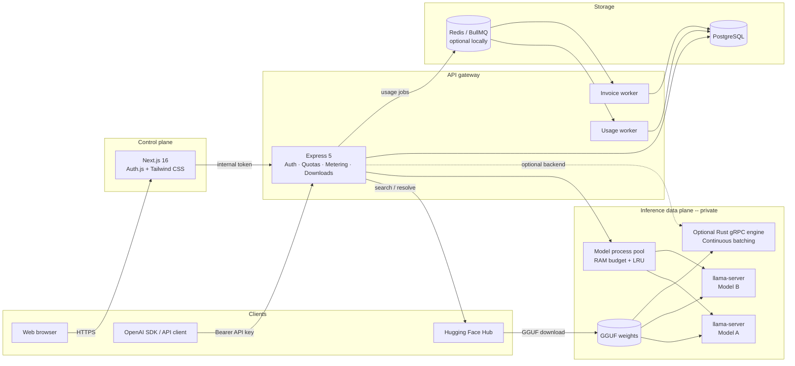
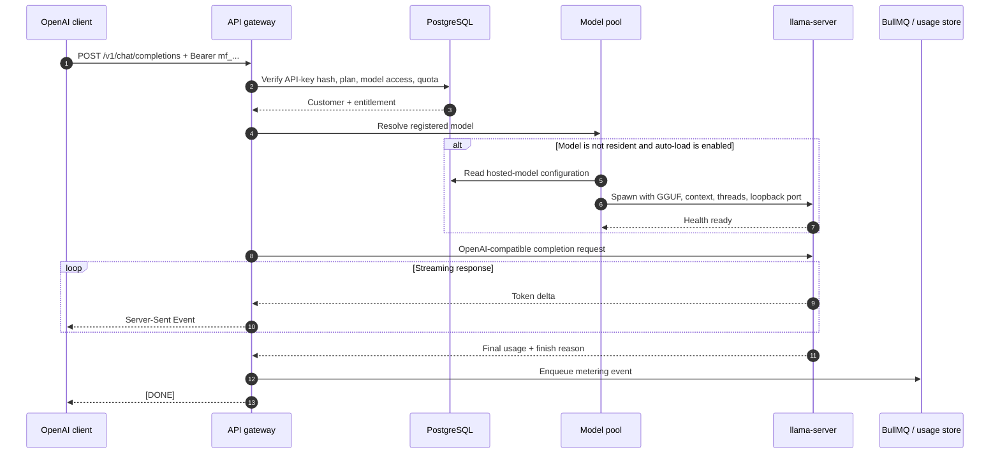
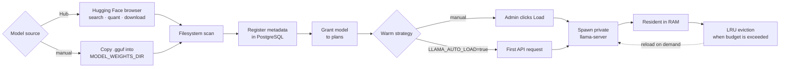
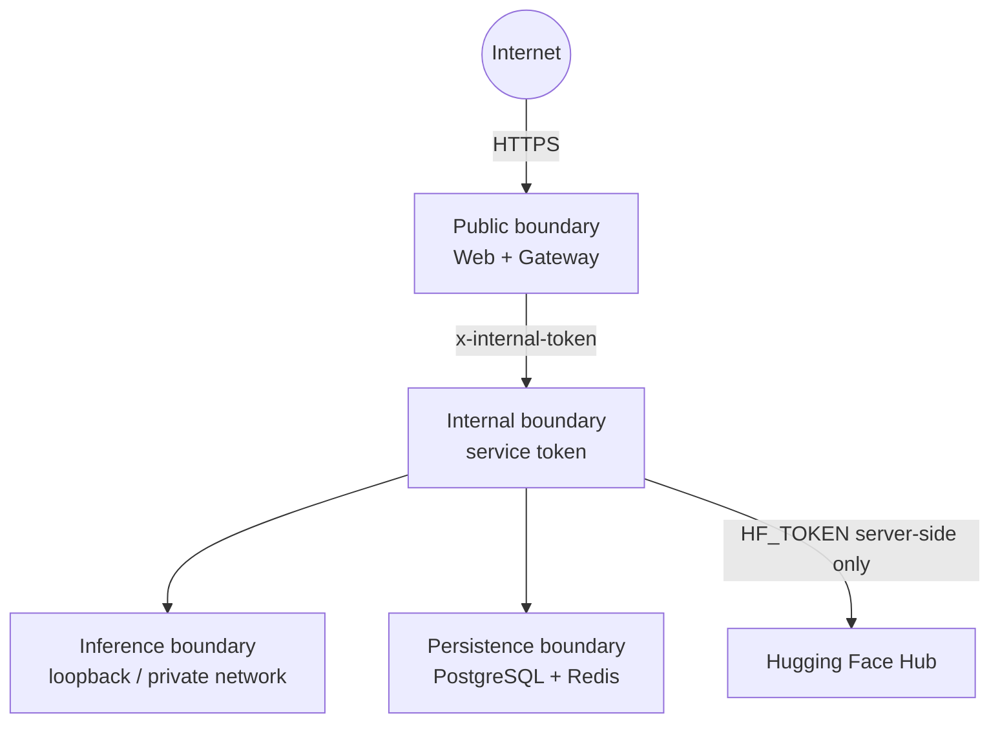

# ModelForge

> A self-hosted LLM runtime platform for serving GGUF models through an
> OpenAI-compatible API -- with Hugging Face downloads, model lifecycle management,
> usage metering, billing primitives, and separate customer and administrator portals.

[](LICENSE)
[](https://nodejs.org/)
[](https://nextjs.org/)
[](https://github.com/ggml-org/llama.cpp)

ModelForge is built for teams that need private, CPU-first inference and data
residency. Model weights and prompts remain on infrastructure you control.
The default backend uses prebuilt `llama-server` binaries, so local operators
do not need a C++ compiler or CUDA toolchain.

## Highlights

- **OpenAI-compatible API** -- streaming and non-streaming
  `/v1/chat/completions`, plus tools/response_format metadata and `model: "auto"`
- **Hugging Face model browser** -- search GGUF repositories, pick quantizations,
  download with resume/SHA-256 verification, and auto-register into the catalog
- **Chat playground** -- subscriber ChatGPT-style chat page and floating bubble,
  with collapsible reasoning blocks for `<think>` models
- **Immutable execution ledger** -- every request gets an `InferenceRequest` with
  attempts, timings, request-time pricing, and idempotent quota commits
- **Signed usage receipts** -- Ed25519 receipts with public-key verification and
  export (`/usage/receipts`, `/verify-receipt`)
- **Budget-aware routing & policies** -- versioned routing/budget/data/tool
  policies with PII redaction and atomic spend ceilings
- **Opt-in Core Inspector** -- one-shot diagnostic capture of pipeline, routing,
  generation, and metering events without storing prompt or response text
- **Residency reservations** -- warm-model leases that protect capacity from LRU
  eviction, plus local node heartbeats and deployments
- **SLO enforcement & credits** -- latency/availability windows with automatic
  service-credit ledger entries
- **Evaluations & canaries** -- revision-gated eval suites and traffic-split
  channels
- **Knowledge & memory** -- tenant knowledge bases, chunk embeddings, retrieval
  cost attribution, and retention controls
- **Local federation simulation** -- loopback node transport with production mTLS
  adapter boundaries
- **LM Studio-style local serving** -- discover GGUF files, register them, and
  load them on demand with progress feedback
- **Process-isolated inference** -- each loaded model runs in a loopback-only
  `llama-server` process
- **RAM-aware model pool** -- configurable budget with reservation-aware eviction
- **Multi-tenant access** -- plans, API keys, quotas, rate limits, and model
  entitlements
- **Operations console** -- dashboards for requests, receipts, policies, nodes,
  SLOs, evaluations, and audit events
- **Usage and billing pipeline** -- token metering, BullMQ workers, invoices,
  and pluggable payment adapters
- **CPU-first defaults** -- mmap, physical-core thread sizing, and conservative
  per-model concurrency
- **Shared services for client apps** -- ASR/LLM APIs plus Neo4j and MinIO are
  owned by ModelForge; products like **Anusandhan** consume them as clients

## Client apps (e.g. Anusandhan)

ModelForge is the **provider**. Investigative / product UIs are **clients**.

| Concern | ModelForge | Anusandhan (client) |
|---|---|---|
| Chat / completions | `/v1/chat/completions` | Calls with API key |
| Voice / ASR | `/v1/voice/analyze` | Uploads audio; stores transcript metadata |
| Graph DB | **Neo4j** (hosted here) | Reads/writes via ModelForge Neo4j |
| Object storage | **MinIO** (hosted here) | Stores object keys; files live in ModelForge MinIO |
| Domain cases / investigator UX | — | Anusandhan Postgres + UI |

Local day-to-day: run ModelForge with `pnpm dev` (or `npm run dev`). Clients point at `GATEWAY_INTERNAL_URL` / `MODELFORGE_BASE_URL`.

### Neo4j

| Environment | How to run Neo4j |
|---|---|
| **Local Windows / Mac** | **[Neo4j Desktop](https://neo4j.com/download/)** — create a local DBMS, set password to match `.env` (`NEO4J_PASSWORD`), start it, use Bolt `bolt://localhost:7687` |
| **Ubuntu server** | Install the **Neo4j Community package** (apt), enable the systemd service — not Desktop |

Ubuntu (production / lab server):

```bash
# Official Neo4j apt repository (Community)
wget -O - https://debian.neo4j.com/neotechnology.gpg.key | sudo gpg --dearmor -o /usr/share/keyrings/neo4j.gpg
echo "deb [signed-by=/usr/share/keyrings/neo4j.gpg] https://debian.neo4j.com stable 5" | sudo tee /etc/apt/sources.list.d/neo4j.list
sudo apt update
sudo apt install -y neo4j
sudo systemctl enable --now neo4j

# Set initial password (once), then put the same value in ModelForge .env
sudo neo4j-admin dbms set-initial-password 'modelforge'
```

Match ModelForge `.env`:

```bash
NEO4J_URI=bolt://localhost:7687
NEO4J_USER=neo4j
NEO4J_PASSWORD=modelforge
```

### MinIO

Hosted by ModelForge for client audio/objects. Locally optional until a client needs uploads to object storage. On Ubuntu, run the MinIO server binary under systemd (or your preferred process manager) and point `MINIO_*` in `.env` at it (`MINIO_ENDPOINT=localhost:9010` by default so it does not clash with gRPC on `9002`).

## System architecture

ModelForge keeps the web control plane, API gateway, and inference runtime
separate. Only the web application and API gateway are intended to be exposed.
Inference ports remain private on loopback or an internal network.



### Component responsibilities

| Component | Responsibility |
|---|---|
| `apps/web` | Authenticated customer and admin UI; browser traffic reaches internal services through server-side routes/actions |
| `apps/gateway` | Public OpenAI API, API-key authentication, plan enforcement, quotas, Hugging Face downloads, inference orchestration, and metering |
| `llama-server` pool | Default inference backend; one private OS process per loaded model |
| `apps/inference-engine` | Optional Rust gRPC backend with mmap model loading and continuous batching |
| PostgreSQL | Users, subscriptions, plans, model registry, API-key hashes, usage events, receipts, and invoices |
| Redis / BullMQ | Production-grade asynchronous usage and invoice jobs; optional for local development |

## Request and data flow

### Chat completion



When Redis is enabled, usage events are written asynchronously through BullMQ.
For lightweight local setups with `REDIS_ENABLED=false`, ModelForge uses the
documented direct-Postgres fallback.

### Model lifecycle



Copying or downloading a model file does not automatically expose it to
customers. Registration creates the catalog entry (Hugging Face downloads can
auto-register after verification), while plan entitlement determines who can
call it.

## Technology stack

| Layer | Technology |
|---|---|
| Control plane | Next.js 16, React, Tailwind CSS 4, Auth.js |
| API gateway | Express 5, Zod, Prisma |
| Default inference | Prebuilt `llama-server` from llama.cpp |
| Optional inference | Rust, tonic gRPC, `llama-cpp-2` |
| Model discovery | Local GGUF scan + Hugging Face Hub API |
| Data | PostgreSQL 16 |
| Queueing | Redis 7, BullMQ |
| Billing | Mock, Stripe, bKash, and Nagad adapters |
| Tooling | TypeScript, pnpm, Turborepo, Vitest, ESLint |

## Repository layout

```text
apps/
  gateway/            OpenAI API, auth, quotas, metering, HF downloads, model pool
  web/                Customer and administrator control plane
  inference-engine/   Optional Rust gRPC inference backend
packages/
  billing/            Invoice calculation and payment adapters
  config/             Shared TypeScript and ESLint configuration
  db/                 Prisma schema, migrations, seed data
  engine/             Shared OpenAI schemas and error contracts
  platform/           Signing, policy, PII, SLO, RAG, and federation helpers
infra/
  docker-compose.dev.yml
  nginx-modelforge.conf   Production Nginx reverse proxy config
  systemd/                Example production service units
scripts/                  Binary fetch, model scan, diagnostics, E2E, benchmark
```

## Prerequisites

- Node.js **20+**
- pnpm **10+**
- PostgreSQL (local install — use your normal `pnpm dev` loop)
- A compatible `.gguf` model, or network access to download one from Hugging Face
- Redis is recommended for production but optional for local development (`REDIS_ENABLED=false`)
- **Neo4j** when graph features / Anusandhan graph are needed:
  - Desktop locally, or
  - Community **apt package** on Ubuntu (see [Client apps](#client-apps-eg-anusandhan))
- **MinIO** when object storage for clients is needed (optional for plain chat/voice)
- **Python 3.10+**, `ffmpeg`, and `pip install -r requirements-voice.txt` when using the voice/STT pipeline (Faster-Whisper + optional NeMo Bangla ASR)

The default `llama-server` backend does **not** require Rust, CMake, Clang,
Visual Studio Build Tools, CUDA, or a system-wide llama.cpp installation.

## Quick start

```bash
# 1. Install dependencies
pnpm install

# 2. Create local configuration
cp .env.example .env

# PowerShell equivalent:
# Copy-Item .env.example .env

# 3. Start PostgreSQL and Redis with Docker
pnpm infra:up

# 4. Generate the Prisma client, apply migrations, and seed
pnpm db:generate
pnpm db:deploy
pnpm db:seed

# 5. Download the official prebuilt llama.cpp CPU binaries
pnpm llama:fetch

# 5b. (Voice/STT) Python ASR runtime — Faster-Whisper + NeMo Bangla
#     Also install ffmpeg (apt/brew/choco) if not already present.
python -m pip install -r requirements-voice.txt
# Ubuntu: python3 -m pip install --break-system-packages -r requirements-voice.txt

# 6. Start the gateway and control plane
# Frees GATEWAY_PORT / WEB_PORT / GRPC_PORT first if something is still bound
pnpm dev
```

Before step 4, update `.env` with secure local values and set
`MODEL_WEIGHTS_DIR` to an **absolute path**. Ports default to the **9000 series**
(`9000` gateway, `9001` web, `9002` gRPC, `9100+` llama-server) so they do not
collide with typical Next.js (`3000`), Express, or Laravel (`8000`) apps. Override
with `GATEWAY_PORT` / `WEB_PORT` in `.env`, or free them alone via `pnpm ports:free`.

| Service | Local URL |
|---|---|
| Control plane | <http://localhost:9001> |
| OpenAI API | <http://localhost:9000/v1> |
| Gateway health | <http://localhost:9000/healthz> |

### Development seed accounts

| Email | Password | Role |
|---|---|---|
| `admin@modelforge.local` | `admin123` | Administrator |
| `demo@modelforge.local` | `demo123` | Customer |

These credentials are for local development only. The seed also prints a
one-time API key. Rotate all secrets and remove or replace seeded credentials
before any shared or production deployment.

## Add and serve a model

### Option A -- Hugging Face browser (recommended)

1. Configure an absolute `MODEL_WEIGHTS_DIR` in `.env`.
2. Optionally set `HF_TOKEN` for private or gated repositories.
3. Sign in as an administrator and open **Model Registry** at `/admin/models`.
4. Search the Hub, select a repository, choose a quantization, and click
   **Download**.
5. Wait for verification to complete. Multi-shard GGUFs are queued together and
   registered only after every shard finishes.
6. Grant the model to the appropriate plans.
7. Optionally pre-warm it from **Infrastructure** at `/admin/infra`.

Downloads are host-side, resumable (`.part` files), SHA-256 verified when Hub
metadata provides a hash, and limited by `HF_MAX_CONCURRENT_DOWNLOADS` /
`HF_MAX_DOWNLOAD_GB`. Partial transfers continue even if the browser tab closes.

### Option B -- Local filesystem

1. Copy a `.gguf` file anywhere below `MODEL_WEIGHTS_DIR`. Nested folders are
   supported.
2. Confirm discovery:

   ```bash
   pnpm weights:scan
   ```

3. Open `/admin/models`, register the discovered file, and review its slug,
   quantization, context length, thread count, and pricing.
4. Grant the model to plans and optionally Load it from `/admin/infra`.

With `LLAMA_AUTO_LOAD=true`, the first authorized API request starts the model
automatically.

```bash
# Inspect backend health, discovered files, and resident models
pnpm engine:status

# Warm a registered model by slug
pnpm engine:status your-model-slug
```

## Subscriber experience

| Surface | Path | Purpose |
|---|---|---|
| Usage overview | `/dashboard` | Throughput, latency, spend, and recent requests |
| Chat | `/chat` | Full-page streaming playground with generation settings |
| Floating chat bubble | all subscriber pages | Compact chat overlay; hidden on `/chat` |
| Core Inspector | `/core-inspector` | Opt-in one-shot diagnostic capture for the next request |
| Requests | `/requests` | Immutable execution history and cost debugger |
| Receipts | `/usage/receipts` | Signed usage proofs and verification |

Reasoning models that emit `<think>` / `<thinking>` / `<reasoning>` tags are
rendered with a collapsible "Thought process" block. The visible answer is
shown separately, and Copy exports the answer only.

## OpenAI-compatible API

### cURL

```bash
curl http://localhost:9000/v1/chat/completions \
  -H "Authorization: Bearer mf_YOUR_KEY" \
  -H "Content-Type: application/json" \
  -d '{
    "model": "your-model-slug",
    "messages": [
      {"role": "system", "content": "You are a concise assistant."},
      {"role": "user", "content": "Explain mmap in one sentence."}
    ],
    "temperature": 0.2,
    "max_tokens": 256,
    "stream": false
  }'
```

### OpenAI JavaScript SDK

```ts
import OpenAI from "openai";

const client = new OpenAI({
  apiKey: process.env.MODELFORGE_API_KEY,
  baseURL: "http://localhost:9000/v1",
});

const response = await client.chat.completions.create({
  model: "your-model-slug",
  messages: [{ role: "user", content: "Hello from ModelForge" }],
});

console.log(response.choices[0]?.message.content);
```

Streaming uses the standard OpenAI Server-Sent Events format and terminates
with `data: [DONE]`.

Use `"model": "auto"` to let versioned routing policies select an entitled
model based on cost, quality, and latency preferences.

### Reasoning models

Some reasoning models consume part of `max_tokens` before producing visible
assistant content. Use an appropriate token budget; a very small limit can
produce an empty `content` field even though reasoning tokens were generated.
All generated tokens count toward metering. The chat UI collapses inline
thought tags so operators can inspect reasoning without burying the answer.

## Voice pipeline (Phase 1)

Phase 1 supports batch voice uploads for Bangla analysis:

1. Browser uploads an audio file to `POST /api/voice/analyze`
2. Web route proxies to `POST /v1/voice/analyze` with dashboard API auth
3. Gateway stores audio under `VOICE_UPLOAD_DIR`
4. STT provider transcribes (Faster-Whisper **or** NeMo Bangla Conformer)
5. Transcript is analyzed through the existing LLM chat pipeline

Required runtime setup:

```bash
# Installs faster-whisper and nemo_toolkit[asr] (see requirements-voice.txt)
python -m pip install -r requirements-voice.txt
# Ubuntu: python3 -m pip install --break-system-packages -r requirements-voice.txt
# ffmpeg must be on PATH (Ubuntu: sudo apt install -y ffmpeg)
```

Install / switch models from **Admin → Infra** (writes `data/voice/runtime.json`). Whisper remains the multilingual default; NeMo [`kazalbrur/bangla-stt-conformer-120m-dialects`](https://huggingface.co/kazalbrur/bangla-stt-conformer-120m-dialects) is stronger on Bangladeshi dialects (CC-BY-NC-4.0). For regional Bengali with Whisper, use [`bengaliAI/tugstugi_bengaliai-regional-asr_whisper-medium`](https://huggingface.co/bengaliAI/tugstugi_bengaliai-regional-asr_whisper-medium) (converted to CTranslate2 on first install; requires `pip install transformers torch`).

The admin **Infrastructure** page shows a live STT status card powered by:

- `GET /internal/voice/status` on the gateway
- `GET /api/admin/engine` on the web app for admin-safe polling

Enable and tune in `.env`:

```bash
VOICE_ENABLED=true
STT_PROVIDER=faster-whisper
# Leave empty or "auto" for language auto-detection; set "bn" to prefer Bangla.
STT_LANGUAGE=
STT_PYTHON_BIN=python3
STT_FASTER_WHISPER_SCRIPT=scripts/faster-whisper-transcribe.py
STT_NEMO_SCRIPT=scripts/nemo-asr-transcribe.py
STT_NEMO_MODEL=kazalbrur/bangla-stt-conformer-120m-dialects
STT_NEMO_DEVICE=cpu
VOICE_UPLOAD_DIR=./data/audio
VOICE_MAX_UPLOAD_MB=20
VOICE_RATE_LIMIT_PER_HOUR=20
VOICE_RETENTION_HOURS=24
# Speaker diarization (turn-based ASR). Needs pyannote.audio + HF_TOKEN and accepted model terms.
DIARIZATION_ENABLED=false
DIARIZATION_MODEL=pyannote/speaker-diarization-community-1
DIARIZATION_DEVICE=cpu
DIARIZATION_SCRIPT=scripts/pyannote-diarize.py
# DIARIZATION_MIN_SPEAKERS=2
# DIARIZATION_MAX_SPEAKERS=2
# HF_TOKEN=hf_...
```

Rollout checklist:

- Enable `VOICE_ENABLED=true` for a staging tenant first
- Confirm transcript accuracy on Bangla dialect samples
- Watch gateway logs for `voice.analyzed` latency and volume
- Verify hourly upload cap and max-upload errors behave as expected
- Enable for broader plans once latency/cost targets are met

### Production voice setup

On Ubuntu production hosts, install the Python runtime once:

```bash
sudo apt update
sudo apt install -y python3 python3-pip ffmpeg
python3 -m pip install --break-system-packages -r requirements-voice.txt
```

That installs **Faster-Whisper** and **NeMo ASR** (`nemo_toolkit[asr]`, used for Bhatiyali Bangla dialects). Pre-download models so first use is not delayed:

```bash
# Whisper (default multilingual path)
python3 - <<'PY'
from faster_whisper import WhisperModel
WhisperModel("small", device="cpu", compute_type="int8")
print("Faster-Whisper model is cached and ready.")
PY

# Optional: NeMo Bhatiyali (Bangla dialects) — large first download
python3 scripts/nemo-asr-transcribe.py --preload --model kazalbrur/bangla-stt-conformer-120m-dialects --device cpu
```

Then make sure your server `.env` contains:

```bash
VOICE_ENABLED=true
VOICE_UPLOAD_DIR=/var/www/modelforge.ai/data/audio
STT_PROVIDER=faster-whisper
# Leave empty or "auto" for language auto-detection; set "bn" to prefer Bangla.
STT_LANGUAGE=
STT_PYTHON_BIN=python3
STT_FASTER_WHISPER_SCRIPT=/var/www/modelforge.ai/scripts/faster-whisper-transcribe.py
STT_FASTER_WHISPER_MODEL=small
STT_FASTER_WHISPER_DEVICE=cpu
STT_FASTER_WHISPER_COMPUTE_TYPE=int8
STT_NEMO_SCRIPT=/var/www/modelforge.ai/scripts/nemo-asr-transcribe.py
STT_NEMO_MODEL=kazalbrur/bangla-stt-conformer-120m-dialects
STT_NEMO_DEVICE=cpu
```

After restarting PM2, verify the admin **Infrastructure** page reports:

- Voice pipeline: `ENABLED`
- Python runtime: `AVAILABLE`
- STT packages: Whisper/NeMo status as installed
- Configured model: your selected model (or install/activate from the Infra UI)

## Inference backends

| Backend | Compiler required | Recommended use |
|---|---:|---|
| `llama-server` | No | Default local and production CPU serving |
| `grpc` | Yes | Optional Rust path for custom continuous batching |

Select the backend with `INFERENCE_BACKEND`.

```bash
# Default
INFERENCE_BACKEND=llama-server

# Optional Rust engine
INFERENCE_BACKEND=grpc
```

The Rust backend is an advanced option. On Windows it requires an MSVC/Clang
and CMake toolchain; on Linux it requires an equivalent native build toolchain.

## Configuration

Copy `.env.example` to `.env`. The most important settings are:

| Variable | Purpose |
|---|---|
| `DATABASE_URL` | PostgreSQL connection string |
| `REDIS_ENABLED` | Enables Redis-backed rate limits and BullMQ workers |
| `REDIS_URL` | Redis connection string |
| `GATEWAY_PORT` | Express API gateway (default `9000`) |
| `WEB_PORT` | Next.js control plane (default `9001`) |
| `GRPC_PORT` | Optional Rust inference gRPC (default `9002`) |
| `MODEL_WEIGHTS_DIR` | Absolute path to local GGUF storage |
| `HF_TOKEN` | Optional read-only token for private or gated Hugging Face repositories |
| `HF_MAX_CONCURRENT_DOWNLOADS` | Concurrent host-side Hub downloads (default `2`) |
| `HF_MAX_DOWNLOAD_GB` | Maximum allowed size for one GGUF file (default `100`) |
| `INFERENCE_BACKEND` | `llama-server` or `grpc` |
| `LLAMA_SERVER_BIN` | Optional explicit path to `llama-server` |
| `LLAMA_AUTO_LOAD` | Loads an entitled model on its first request |
| `LLAMA_REASONING` | Pass-through to `llama-server` (`off` recommended for chat UX) |
| `INFERENCE_TIMEOUT_MS` | Abort long generations (default `900000`) |
| `TOTAL_RAM_BUDGET_MB` | Model-pool RAM budget used for LRU decisions |
| `MAX_CONCURRENT_PER_MODEL` | Per-model concurrency ceiling |
| `INTERNAL_SERVICE_TOKEN` | Protects internal gateway routes |
| `JWT_SECRET` / `AUTH_SECRET` | Gateway and Auth.js signing secrets |
| `MODELFORGE_SIGNING_DIR` | Ed25519 usage-receipt key storage |
| `MODELFORGE_PII_REDACT` | Redact emails/phones/cards before inference |
| `BILLING_MODE` | `mock` or a configured live payment flow |

Never commit `.env`. The repository includes `.env.example` with development
placeholders only. `HF_TOKEN` stays server-side and is never exposed to the
browser.

## Authentication, quotas, and billing

- Raw API keys are shown once; only **SHA-256 hashes** are persisted.
- Every API key belongs to a customer with a subscription and plan.
- Plans define model access, token quota, requests per minute, concurrency,
  and overage pricing.
- Usage records include prompt tokens, completion tokens, model, latency, and
  an idempotency key.
- Dashboard chat uses a session-scoped credential through the same quota,
  policy, metering, and receipt pipeline as API traffic.
- `BILLING_MODE=mock` works without credentials.
- Stripe can be enabled with its secret and webhook keys.
- bKash and Nagad adapters provide extension points for Bangladesh payments.

## Development and verification

```bash
# Repository checks
pnpm lint
pnpm typecheck
pnpm test

# Confirm the configured weights directory
pnpm weights:scan

# Inspect inference state
pnpm engine:status

# OpenAI SDK compatibility (gateway must be running)
MODELFORGE_API_KEY=mf_YOUR_KEY pnpm test:e2e

# Opt-in Core Inspector capture against a live subscriber key
pnpm test:inspector

# Basic concurrency benchmark
MODELFORGE_API_KEY=mf_YOUR_KEY pnpm benchmark

# Real llama-server integration tests
pnpm --filter @modelforge/gateway test
```

## Production deployment (Ubuntu + PM2 + Nginx)

The recommended production setup uses PM2 as the process manager and Nginx as
the reverse proxy. The project root is typically `/var/www/modelforge.ai`.

### 1. Server prerequisites

```bash
# Node.js 20+, pnpm, PM2
curl -fsSL https://deb.nodesource.com/setup_20.x | sudo -E bash -
sudo apt install -y nodejs
npm i -g pnpm pm2

# PostgreSQL and Redis
sudo apt install -y postgresql redis-server

# Neo4j Community (graph for ModelForge clients such as Anusandhan)
wget -O - https://debian.neo4j.com/neotechnology.gpg.key | sudo gpg --dearmor -o /usr/share/keyrings/neo4j.gpg
echo "deb [signed-by=/usr/share/keyrings/neo4j.gpg] https://debian.neo4j.com stable 5" | sudo tee /etc/apt/sources.list.d/neo4j.list
sudo apt update
sudo apt install -y neo4j
sudo systemctl enable --now neo4j
# sudo neo4j-admin dbms set-initial-password 'YOUR_NEO4J_PASSWORD'
```

Set in `/var/www/modelforge.ai/.env` (same password you configured):

```bash
NEO4J_URI=bolt://localhost:7687
NEO4J_USER=neo4j
NEO4J_PASSWORD=YOUR_NEO4J_PASSWORD
MINIO_ENDPOINT=localhost:9010
MINIO_ACCESS_KEY=...
MINIO_SECRET_KEY=...
MINIO_BUCKET=modelforge-audio
```

> **Note:** On Ubuntu use the **Neo4j package + systemd**, not Neo4j Desktop. Desktop is for local Windows/Mac development only.

### 2. Clone, install, and build

```bash
cd /var/www/modelforge.ai

pnpm install --frozen-lockfile

# Create .env from the example and fill in secrets
cp .env.example .env
nano .env    # DATABASE_URL, JWT_SECRET, AUTH_SECRET, REDIS_URL, etc.

# Install Python STT runtime for voice uploads (Whisper + NeMo Bangla)
sudo apt install -y python3 python3-pip ffmpeg
python3 -m pip install --break-system-packages -r requirements-voice.txt

# Generate Prisma client, run migrations, seed
pnpm db:generate
pnpm db:deploy
pnpm db:seed

# Fetch prebuilt llama-server binary (Linux x86_64)
pnpm llama:fetch

# Build all packages and apps
pnpm build
```

If you want the Whisper model downloaded before the first user upload:

```bash
python3 - <<'PY'
from faster_whisper import WhisperModel
WhisperModel("small", device="cpu", compute_type="int8")
print("Voice model cache ready.")
PY
```

### 3. Start with PM2

An `ecosystem.config.cjs` is included in the repository root. It starts four
processes:

| PM2 name | What it runs | Port |
|---|---|---|
| `modelforge-gateway` | Express API + llama-server process pool | `9000` |
| `modelforge-web` | Next.js control plane | `9001` |
| `modelforge-usage-worker` | BullMQ usage event persistence | -- |
| `modelforge-invoice-worker` | Scheduled invoice generation | -- |

```bash
pm2 start ecosystem.config.cjs
pm2 save
pm2 startup    # auto-start on server reboot
```

Adjust `APP_ROOT` at the top of `ecosystem.config.cjs` if your deploy path
differs from `/var/www/modelforge.ai`.

### 4. Nginx reverse proxy

An example Nginx config is provided at `infra/nginx-modelforge.conf`.

```bash
sudo cp infra/nginx-modelforge.conf /etc/nginx/sites-available/modelforge.conf
sudo ln -s /etc/nginx/sites-available/modelforge.conf /etc/nginx/sites-enabled/
# Edit server_name to your domain or IP
sudo nano /etc/nginx/sites-available/modelforge.conf
sudo nginx -t && sudo systemctl reload nginx
```

The Nginx config routes:

| Location | Upstream | Purpose |
|---|---|---|
| `/` | Next.js `:9001` | Admin panel, customer portal, chat UI |
| `/v1/` | Gateway `:9000` | OpenAI-compatible API with SSE streaming |
| `/internal/` | Gateway `:9000` | Management routes, **localhost only** |
| `/_next/static/` | Next.js `:9001` | Static assets with long-lived cache |
| `/healthz` | Gateway `:9000` | Health check endpoint |

gRPC (`:9002`) and llama-server ports (`:9100+`) are never proxied.

### 5. SSL with Let's Encrypt (optional)

```bash
sudo apt install certbot python3-certbot-nginx
sudo certbot --nginx -d your-domain.com
```

Then uncomment the HTTPS server block in `infra/nginx-modelforge.conf`.

### Production hardening checklist

- Use unique, high-entropy values for `INTERNAL_SERVICE_TOKEN`, `JWT_SECRET`,
  and `AUTH_SECRET`.
- Keep `HF_TOKEN` as a read-only Hub token with minimum scopes; rotate
  regularly.
- Keep `MAX_CONCURRENT_PER_MODEL` low for CPU inference (1-2).
- Set `DEFAULT_N_THREADS` near the physical-core count, not logical thread
  count.
- Reserve 25-30% of system RAM outside `TOTAL_RAM_BUDGET_MB`.
- Keep mmap enabled unless the storage environment requires otherwise.
- Size `INFERENCE_TIMEOUT_MS` for your host's tok/s multiplied by max
  completion length.
- Back up PostgreSQL regularly and treat model files as separately managed
  artifacts.
- Remove or change the seeded dev accounts before opening to real users.

## Modern platform features

Local-first vertical slices are enabled by default after
`pnpm db:deploy && pnpm db:seed`:

| Capability | Where to look |
|---|---|
| Hugging Face GGUF browser | `/admin/models` |
| Model load progress + eject confirm | `/admin/infra` |
| Chat playground + floating bubble | `/chat` |
| Immutable executions + cost debugger | `/requests`, `GET /v1/requests/:id` |
| Signed usage receipts | `/usage/receipts`, `/verify-receipt`, `/.well-known/modelforge-usage-keys.json` |
| Policies, budgets, auto-routing | `/policies`, `/budgets`, `model: "auto"` |
| Residency reservations + nodes | `/reservations`, `/admin/nodes` |
| SLO windows + service credits | `/reliability`, `/admin/slo` |
| Evaluations + canaries | `/admin/evaluations` |
| Knowledge ingest | `/knowledge` |
| Audit trail | `/admin/audit` |
| Opt-in Inference Core Inspector | `/core-inspector` |

The Core Inspector is disabled during normal inference. A subscriber can arm a
10-minute, one-shot capture for the next request; it records privacy-safe
pipeline, routing, runtime, token-batch, and performance events, then
automatically deactivates. Prompt and response content are never retained.
Per-token MoE routing and attention tensors are reported as unavailable unless
an instrumented runtime adapter can provide genuine data.

Optional Redis workers for SLO rollups and evaluations:

```bash
pnpm --filter @modelforge/gateway modern-worker
```

Signing keys live under `MODELFORGE_SIGNING_DIR` (default `./data/signing`) and
are gitignored. Production deployments should swap the local file signer for a
KMS/HSM provider behind the same `SigningProvider` interface.

## Security model



- Helmet and explicit CORS configuration protect the Express surface.
- Public inference calls require a valid hashed API key.
- Browser sessions are handled by Auth.js with role-gated admin routes.
- Internal management routes require `x-internal-token`.
- Model processes bind to `127.0.0.1`.
- Browser clients do not call private inference ports directly.
- Hugging Face downloads are initiated by admins only; the Hub token and
  destination paths never leave the gateway.
- Download destinations are constrained under `MODEL_WEIGHTS_DIR` and verified
  against Hub manifests before transfer.
- GGUF weights, prebuilt runtime binaries, secrets, and generated artifacts are
  excluded from version control.

Security reports should not include raw credentials, API keys, model weights,
or customer data in a public issue.

## Files intentionally excluded from Git

| Path | Reason |
|---|---|
| `.env` | Contains local credentials and secrets |
| `data/models/**/*.gguf` | Large model artifacts with independent licenses |
| `data/models/**/*.gguf.part` | Incomplete Hugging Face downloads |
| `data/signing/` | Local usage-receipt signing material |
| `vendor/llama.cpp` | Reproducibly fetched with `pnpm llama:fetch` |
| `node_modules/`, `.next/`, `dist/`, `target/` | Dependency and build outputs |

## Project status

ModelForge is an early public release with a working local-first modern control
plane: Hugging Face GGUF acquisition, chat playground, immutable executions,
signed receipts, policy routing, residency reservations, SLO credits,
evaluations, knowledge ingest, Core Inspector diagnostics, and federation
adapter boundaries. Payment integrations default to mock mode and should be
validated against provider sandboxes before production use.

Issues and focused pull requests are welcome.

## License

ModelForge is released under the [MIT License](LICENSE).

Copyright 2026 Shahjahan Ali.
