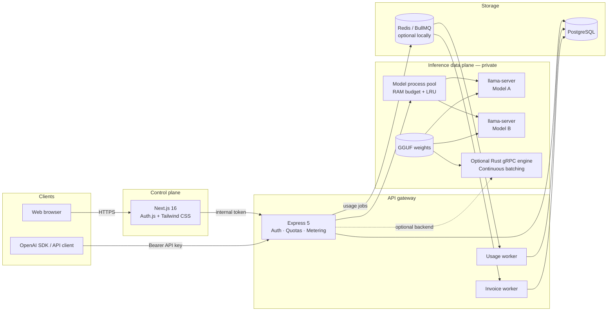
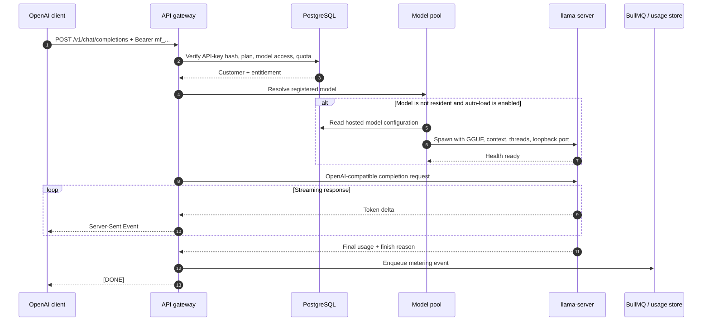
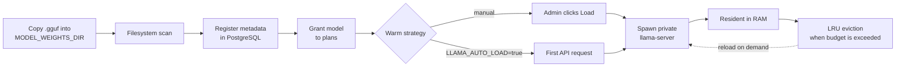
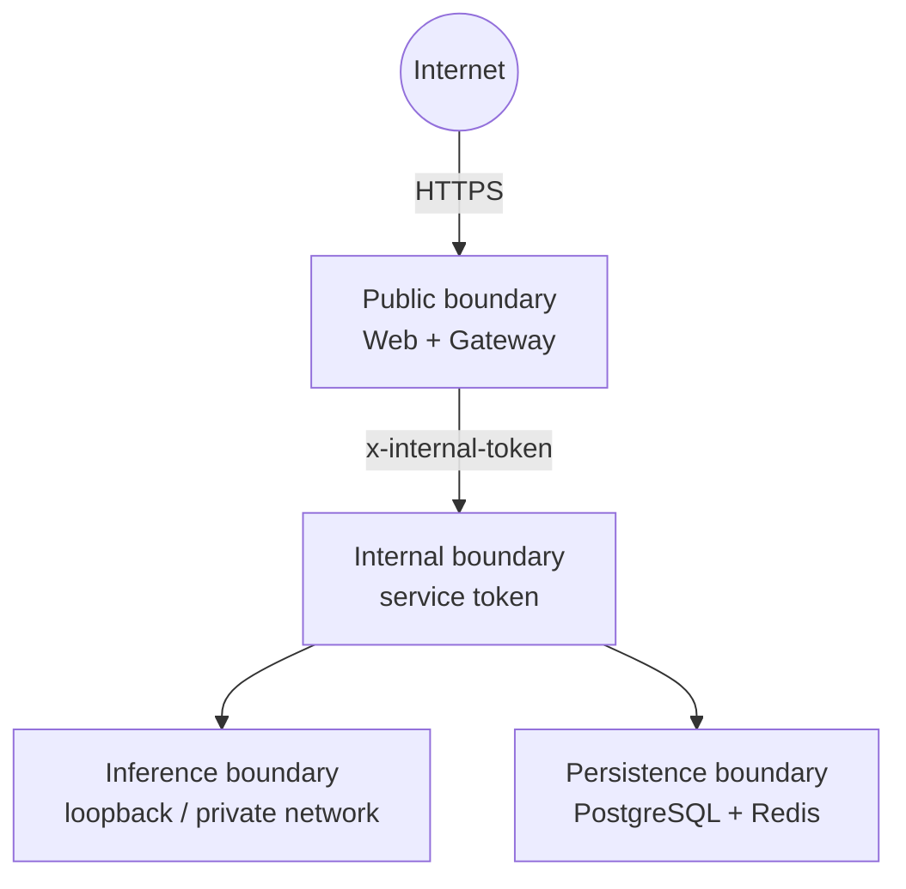

# ModelForge

> A self-hosted LLM runtime platform for serving GGUF models through an
> OpenAI-compatible API—with model lifecycle management, usage metering,
> billing primitives, and separate customer and administrator portals.

[](LICENSE)
[](https://nodejs.org/)
[](https://nextjs.org/)
[](https://github.com/ggml-org/llama.cpp)

ModelForge is built for teams that need private, CPU-first inference and data
residency. Model weights and prompts remain on infrastructure you control.
The default backend uses prebuilt `llama-server` binaries, so local operators
do not need a C++ compiler or CUDA toolchain.

## Highlights

- **OpenAI-compatible API** — streaming and non-streaming
  `/v1/chat/completions`, plus tools/response_format metadata and `model: "auto"`
- **Immutable execution ledger** — every request gets an `InferenceRequest` with
  attempts, timings, request-time pricing, and idempotent quota commits
- **Signed usage receipts** — Ed25519 receipts with public-key verification and
  export (`/usage/receipts`, `/verify-receipt`)
- **Budget-aware routing & policies** — versioned routing/budget/data/tool
  policies with PII redaction and atomic spend ceilings
- **Residency reservations** — warm-model leases that protect capacity from LRU
  eviction, plus local node heartbeats and deployments
- **SLO enforcement & credits** — latency/availability windows with automatic
  service-credit ledger entries
- **Evaluations & canaries** — revision-gated eval suites and traffic-split
  channels
- **Knowledge & memory** — tenant knowledge bases, chunk embeddings, retrieval
  cost attribution, and retention controls
- **Local federation simulation** — loopback node transport with production mTLS
  adapter boundaries
- **LM Studio-style local serving** — discover GGUF files, register them, and
  load them on demand
- **Process-isolated inference** — each loaded model runs in a loopback-only
  `llama-server` process
- **RAM-aware model pool** — configurable budget with reservation-aware eviction
- **Multi-tenant access** — plans, API keys, quotas, rate limits, and model
  entitlements
- **Operations console** — dashboards for requests, receipts, policies, nodes,
  SLOs, evaluations, and audit events
- **Usage and billing pipeline** — token metering, BullMQ workers, invoices,
  and pluggable payment adapters
- **CPU-first defaults** — mmap, physical-core thread sizing, and conservative
  per-model concurrency

## System architecture

ModelForge keeps the web control plane, API gateway, and inference runtime
separate. Only the web application and API gateway are intended to be exposed.
Inference ports remain private on loopback or an internal network.



### Component responsibilities

| Component | Responsibility |
|---|---|
| `apps/web` | Authenticated customer and admin UI; browser traffic reaches internal services through server-side routes/actions |
| `apps/gateway` | Public OpenAI API, API-key authentication, plan enforcement, quotas, inference orchestration, and metering |
| `llama-server` pool | Default inference backend; one private OS process per loaded model |
| `apps/inference-engine` | Optional Rust gRPC backend with mmap model loading and continuous batching |
| PostgreSQL | Users, subscriptions, plans, model registry, API-key hashes, usage events, and invoices |
| Redis / BullMQ | Production-grade asynchronous usage and invoice jobs; optional for local development |

## Request and data flow

### Chat completion



When Redis is enabled, usage events are written asynchronously through BullMQ.
For lightweight local setups with `REDIS_ENABLED=false`, ModelForge uses the
documented direct-Postgres fallback.

### Model lifecycle



Copying a model file does not automatically expose it to customers. Registration
creates the catalog entry, while plan entitlement determines who can call it.

## Technology stack

| Layer | Technology |
|---|---|
| Control plane | Next.js 16, React, Tailwind CSS 4, Auth.js |
| API gateway | Express 5, Zod, Prisma |
| Default inference | Prebuilt `llama-server` from llama.cpp |
| Optional inference | Rust, tonic gRPC, `llama-cpp-2` |
| Data | PostgreSQL 16 |
| Queueing | Redis 7, BullMQ |
| Billing | Mock, Stripe, bKash, and Nagad adapters |
| Tooling | TypeScript, pnpm, Turborepo, Vitest, ESLint |

## Repository layout

```text
apps/
├── gateway/            OpenAI API, auth, quotas, metering, model pool
├── web/                Customer and administrator control plane
└── inference-engine/   Optional Rust gRPC inference backend
packages/
├── billing/            Invoice calculation and payment adapters
├── config/             Shared TypeScript and ESLint configuration
├── db/                 Prisma schema, migrations, seed data
└── engine/             Shared OpenAI schemas and error contracts
infra/
├── docker-compose.dev.yml
└── systemd/            Example production service units
scripts/                Binary fetch, model scan, diagnostics, E2E, benchmark
```

## Prerequisites

- Node.js **20+**
- pnpm **10+**
- PostgreSQL, either local or through Docker
- A compatible `.gguf` model
- Redis is recommended for production but optional for local development

The default `llama-server` backend does **not** require Rust, CMake, Clang,
Visual Studio Build Tools, CUDA, or a system-wide llama.cpp installation.

## Quick start

```bash
# 1. Install dependencies
pnpm install

# 2. Create local configuration
cp .env.example .env

# PowerShell equivalent:
# Copy-Item .env.example .env

# 3. Start PostgreSQL and Redis with Docker
pnpm infra:up

# 4. Generate the Prisma client, apply migrations, and seed
pnpm db:generate
pnpm db:deploy
pnpm db:seed

# 5. Download the official prebuilt llama.cpp CPU binaries
pnpm llama:fetch

# 6. Start the gateway and control plane
pnpm dev
```

Before step 4, update `.env` with secure local values and set
`MODEL_WEIGHTS_DIR` to an **absolute path**.

| Service | Local URL |
|---|---|
| Control plane | <http://localhost:3001> |
| OpenAI API | <http://localhost:3000/v1> |
| Gateway health | <http://localhost:3000/healthz> |

### Development seed accounts

| Email | Password | Role |
|---|---|---|
| `admin@modelforge.local` | `admin123` | Administrator |
| `demo@modelforge.local` | `demo123` | Customer |

These credentials are for local development only. The seed also prints a
one-time API key. Rotate all secrets and remove or replace seeded credentials
before any shared or production deployment.

## Add and serve a model

1. Configure an absolute `MODEL_WEIGHTS_DIR` in `.env`.
2. Copy a GGUF file anywhere below that directory. Nested folders are supported.
3. Confirm discovery:

   ```bash
   pnpm weights:scan
   ```

4. Sign in as an administrator and open **Model Registry** at `/admin/models`.
5. Register the discovered file and review its slug, quantization, context
   length, thread count, and pricing.
6. Grant the model to the appropriate plans.
7. Optionally pre-warm it from **Infrastructure** at `/admin/infra`.

With `LLAMA_AUTO_LOAD=true`, the first authorized API request starts the model
automatically.

```bash
# Inspect backend health, discovered files, and resident models
pnpm engine:status

# Warm a registered model by slug
pnpm engine:status your-model-slug
```

## OpenAI-compatible API

### cURL

```bash
curl http://localhost:3000/v1/chat/completions \
  -H "Authorization: Bearer mf_YOUR_KEY" \
  -H "Content-Type: application/json" \
  -d '{
    "model": "your-model-slug",
    "messages": [
      {"role": "system", "content": "You are a concise assistant."},
      {"role": "user", "content": "Explain mmap in one sentence."}
    ],
    "temperature": 0.2,
    "max_tokens": 256,
    "stream": false
  }'
```

### OpenAI JavaScript SDK

```ts
import OpenAI from "openai";

const client = new OpenAI({
  apiKey: process.env.MODELFORGE_API_KEY,
  baseURL: "http://localhost:3000/v1",
});

const response = await client.chat.completions.create({
  model: "your-model-slug",
  messages: [{ role: "user", content: "Hello from ModelForge" }],
});

console.log(response.choices[0]?.message.content);
```

Streaming uses the standard OpenAI Server-Sent Events format and terminates
with `data: [DONE]`.

### Reasoning models

Some reasoning models consume part of `max_tokens` before producing visible
assistant content. Use an appropriate token budget; a very small limit can
produce an empty `content` field even though reasoning tokens were generated.
All generated tokens count toward metering.

## Inference backends

| Backend | Compiler required | Recommended use |
|---|---:|---|
| `llama-server` | No | Default local and production CPU serving |
| `grpc` | Yes | Optional Rust path for custom continuous batching |

Select the backend with `INFERENCE_BACKEND`.

```bash
# Default
INFERENCE_BACKEND=llama-server

# Optional Rust engine
INFERENCE_BACKEND=grpc
```

The Rust backend is an advanced option. On Windows it requires an MSVC/Clang
and CMake toolchain; on Linux it requires an equivalent native build toolchain.

## Configuration

Copy `.env.example` to `.env`. The most important settings are:

| Variable | Purpose |
|---|---|
| `DATABASE_URL` | PostgreSQL connection string |
| `REDIS_ENABLED` | Enables Redis-backed rate limits and BullMQ workers |
| `REDIS_URL` | Redis connection string |
| `MODEL_WEIGHTS_DIR` | Absolute path to local GGUF storage |
| `INFERENCE_BACKEND` | `llama-server` or `grpc` |
| `LLAMA_SERVER_BIN` | Optional explicit path to `llama-server` |
| `LLAMA_AUTO_LOAD` | Loads an entitled model on its first request |
| `TOTAL_RAM_BUDGET_MB` | Model-pool RAM budget used for LRU decisions |
| `MAX_CONCURRENT_PER_MODEL` | Per-model concurrency ceiling |
| `INTERNAL_SERVICE_TOKEN` | Protects internal gateway routes |
| `JWT_SECRET` / `AUTH_SECRET` | Gateway and Auth.js signing secrets |
| `BILLING_MODE` | `mock` or a configured live payment flow |

Never commit `.env`. The repository includes `.env.example` with development
placeholders only.

## Authentication, quotas, and billing

- Raw API keys are shown once; only **SHA-256 hashes** are persisted.
- Every API key belongs to a customer with a subscription and plan.
- Plans define model access, token quota, requests per minute, concurrency,
  and overage pricing.
- Usage records include prompt tokens, completion tokens, model, latency, and
  an idempotency key.
- `BILLING_MODE=mock` works without credentials.
- Stripe can be enabled with its secret and webhook keys.
- bKash and Nagad adapters provide extension points for Bangladesh payments.

## Development and verification

```bash
# Repository checks
pnpm lint
pnpm typecheck
pnpm test

# Confirm the configured weights directory
pnpm weights:scan

# Inspect inference state
pnpm engine:status

# OpenAI SDK compatibility (gateway must be running)
MODELFORGE_API_KEY=mf_YOUR_KEY pnpm test:e2e

# Basic concurrency benchmark
MODELFORGE_API_KEY=mf_YOUR_KEY pnpm benchmark

# Real llama-server integration tests
pnpm --filter @modelforge/gateway test
```

## Production guidance

- Put TLS and a reverse proxy or ingress in front of the web app and gateway.
- Never expose `llama-server` or the inference gRPC port to the public network.
- Use a unique, high-entropy `INTERNAL_SERVICE_TOKEN`, `JWT_SECRET`, and
  `AUTH_SECRET`.
- Enable Redis and run the usage and invoice workers:

  ```bash
  pnpm --filter @modelforge/gateway worker
  pnpm --filter @modelforge/gateway invoice-worker
  ```

- Keep `MAX_CONCURRENT_PER_MODEL` low for CPU inference, commonly 1–2.
- Set model threads near the physical-core count, not logical thread count.
- Reserve approximately 25–30% of system RAM outside
  `TOTAL_RAM_BUDGET_MB`.
- Keep mmap enabled unless the storage or deployment environment requires
  otherwise.
- Back up PostgreSQL and treat model files as separately managed artifacts.
- Review the example service definitions in `infra/systemd/` before deployment.

## Modern platform features

Local-first vertical slices are enabled by default after
`pnpm db:deploy && pnpm db:seed`:

| Capability | Where to look |
|---|---|
| Immutable executions + cost debugger | `/requests`, `GET /v1/requests/:id` |
| Signed usage receipts | `/usage/receipts`, `/verify-receipt`, `/.well-known/modelforge-usage-keys.json` |
| Policies, budgets, auto-routing | `/policies`, `/budgets`, `model: "auto"` |
| Residency reservations + nodes | `/reservations`, `/admin/nodes` |
| SLO windows + service credits | `/reliability`, `/admin/slo` |
| Evaluations + canaries | `/admin/evaluations` |
| Knowledge ingest | `/knowledge` |
| Audit trail | `/admin/audit` |

Optional Redis workers for SLO rollups and evaluations:

```bash
pnpm --filter @modelforge/gateway modern-worker
```

Signing keys live under `MODELFORGE_SIGNING_DIR` (default `./data/signing`) and
are gitignored. Production deployments should swap the local file signer for a
KMS/HSM provider behind the same `SigningProvider` interface.

## Security model



- Helmet and explicit CORS configuration protect the Express surface.
- Public inference calls require a valid hashed API key.
- Browser sessions are handled by Auth.js with role-gated admin routes.
- Internal management routes require `x-internal-token`.
- Model processes bind to `127.0.0.1`.
- Browser clients do not call private inference ports directly.
- GGUF weights, prebuilt runtime binaries, secrets, and generated artifacts are
  excluded from version control.

Security reports should not include raw credentials, API keys, model weights,
or customer data in a public issue.

## Files intentionally excluded from Git

| Path | Reason |
|---|---|
| `.env` | Contains local credentials and secrets |
| `data/models/*.gguf` | Large model artifacts with independent licenses |
| `vendor/llama.cpp` | Reproducibly fetched with `pnpm llama:fetch` |
| `node_modules/`, `.next/`, `dist/`, `target/` | Dependency and build outputs |

## Project status

ModelForge is an early public release with a working local-first modern control
plane: immutable executions, signed receipts, policy routing, residency
reservations, SLO credits, evaluations, knowledge ingest, and federation
adapter boundaries. Payment integrations default to mock mode and should be
validated against provider sandboxes before production use.

Issues and focused pull requests are welcome.

## License

ModelForge is released under the [MIT License](LICENSE).

Copyright © 2026 Shahjahan Ali.
