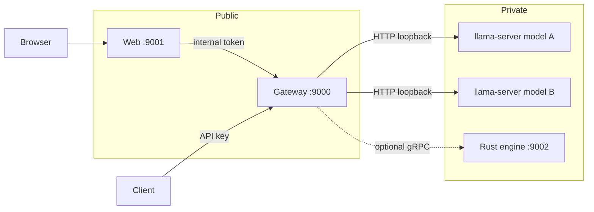
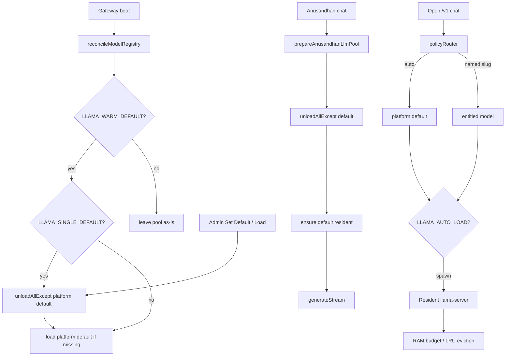
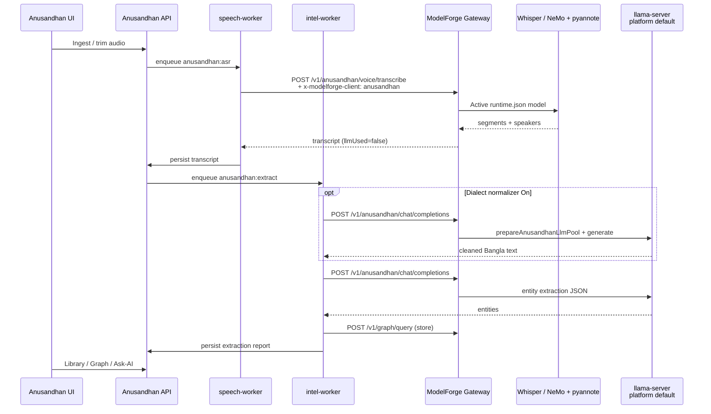
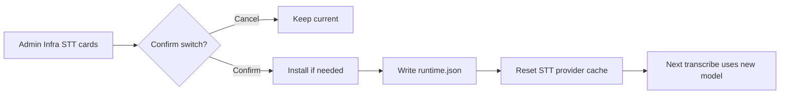
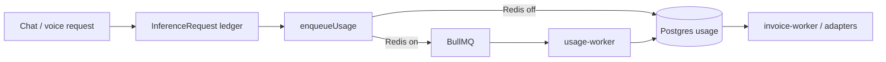

# ModelForge — Current System Architecture & Process Flows

> Snapshot of how ModelForge is wired **today** (gateway + web + llama-server pool + Anusandhan client API).  
> For day-to-day ops, see [OPERATIONS.md](./OPERATIONS.md). For Anusandhan contract details, see that product’s `docs/MODELFORGE-CLIENT.md`.

---

## 1. Design principles

| Principle | Practice |
|---|---|
| Process isolation | Control Plane (Next.js), API Gateway (Express), and Inference (`llama-server` / optional Rust gRPC) stay separate |
| Private inference | Inference ports stay on loopback / internal network — browsers never call them |
| CPU-first defaults | mmap on, low `MAX_CONCURRENT_PER_MODEL`, physical-core `n_threads` |
| OpenAI-compatible surface | Shared shapes in `packages/engine` |
| No raw API keys at rest | SHA-256 hashes only |
| Metering off hot path | BullMQ when Redis is on; direct Postgres when `REDIS_ENABLED=false` |
| Client apps are consumers | Products like **Anusandhan** call ModelForge; they do not run local ASR/LLM for production |

---

## 2. System context

```mermaid
flowchart TB
  subgraph External["External / clients"]
    Browser["Browser"]
    AnuWorkers["Anusandhan speech-worker · intel-worker"]
    SDK["OpenAI SDK / other API clients"]
    HF["Hugging Face Hub"]
  end

  subgraph MF["ModelForge"]
    subgraph CP["Control Plane — apps/web :9001"]
      Next["Next.js + NextAuth"]
      AdminUI["Admin · Customer portals"]
    end

    subgraph GW["API Gateway — apps/gateway :9000"]
      Express["Express"]
      V1["/v1/*"]
      AnuAPI["/v1/anusandhan/*"]
      Internal["/internal/*"]
      Voice["Voice STT + diarization"]
      PoolMgr["Model pool manager"]
    end

    subgraph Inf["Inference — private"]
      Llama["llama-server processes<br/>(per loaded GGUF)"]
      Rust["Optional Rust gRPC :9002"]
    end

    subgraph Data["Data plane"]
      PG[("PostgreSQL")]
      Redis[("Redis — optional")]
      Neo[("Neo4j")]
      MinIO[("MinIO — optional")]
      Weights["data/models · GGUF"]
      VoiceRT["data/voice/runtime.json"]
      Audio["data/audio · uploads"]
    end
  end

  Browser --> Next
  Next -->|x-internal-token| Internal
  AnuWorkers -->|Bearer mf_…| AnuAPI
  SDK -->|Bearer mf_…| V1
  Express --> V1 & AnuAPI & Internal
  Voice --> Audio
  Voice --> VoiceRT
  PoolMgr --> Llama
  PoolMgr -.-> Rust
  Express --> PG
  Express --> Neo
  Express -.-> MinIO
  Express -->|jobs when Redis on| Redis
  PoolMgr --> Weights
  HF --> Internal
  Voice -.->|Python scripts| STT["faster-whisper / NeMo / pyannote"]
```



### Default local ports

| Service | Port | Public? |
|---|---|---|
| Web (control plane) | `9001` | Yes (browser) |
| Gateway | `9000` | Yes (API clients / web proxy) |
| llama-server pool | `9100+` | **No** — loopback only |
| Inference gRPC (optional) | `9002` | **No** |
| MinIO API | `9010` | Internal / shared with clients |
| Neo4j Bolt | `7687` | Internal |

---

## 3. Monorepo layout

| Path | Role |
|---|---|
| `apps/web` | Control plane UI + Auth.js + server proxies to gateway |
| `apps/gateway` | Public API, Anusandhan client API, internal admin API, voice, pool, metering |
| `apps/gateway/src/workers/*` | Usage / invoice / modern BullMQ workers |
| `apps/inference-engine` | Optional Rust gRPC + in-process llama.cpp (`INFERENCE_BACKEND=grpc`) |
| `packages/db` | Prisma schema — tenants, hashed keys, hosted models, usage, receipts |
| `packages/engine` | OpenAI-compatible request/response schemas |
| `packages/platform` | Routing policy, PII, receipts/signing, SLO, RAG helpers |
| `packages/billing` | Invoices + mock/Stripe/bKash/Nagad adapters |
| `scripts/` | Python STT / diarization entrypoints |
| `data/models` | GGUF weights |
| `data/voice/runtime.json` | Admin-activated STT provider + model override |

**Default inference backend:** gateway spawns prebuilt **`llama-server`** binaries (`INFERENCE_BACKEND=llama-server`). No C++ toolchain required.

---

## 4. Process isolation



Rules enforced by design:

1. Browser → **Next.js** → Gateway `/internal` (never direct to llama-server).
2. External product workers → Gateway `/v1` or `/v1/anusandhan` with Bearer key.
3. Only one GGUF is kept resident when `LLAMA_SINGLE_DEFAULT=true` (startup + Anusandhan LLM prep).

---

## 5. Auth & tenancy

| Surface | Mechanism |
|---|---|
| API (`/v1`, `/v1/anusandhan`) | `Authorization: Bearer mf_…` → SHA-256 lookup; plan entitlements + quotas |
| Internal (`/internal`) | `x-internal-token` = `INTERNAL_SERVICE_TOKEN` |
| Web portals | NextAuth credentials (argon2); roles `CUSTOMER` \| `ADMIN` |
| Anusandhan (optional harden) | `x-modelforge-client: anusandhan` when `ANUSANDHAN_REQUIRE_CLIENT_HEADER=true` |

---

## 6. API surface (current)

### Open API — `/v1/*`

| Method | Path | Purpose |
|---|---|---|
| GET | `/models` | Entitled model list |
| POST | `/chat/completions` | Streaming / non-streaming chat; `model: "auto"` → platform default |
| POST | `/voice/analyze` | ASR (+ diarization) **then** LLM analysis; or `VOICE_PIPELINE=gemini` single multimodal call |
| GET/POST | `/graph/*` | Neo4j stats / query / store |
| GET | `/usage/receipts/:requestId` | Signed usage receipts |

### Anusandhan client API — `/v1/anusandhan/*`

Isolated from open `auto` routing. Ignores arbitrary model picks for chat.

| Method | Path | Purpose |
|---|---|---|
| GET | `/models` | Platform default only |
| POST | `/voice/transcribe` | ASR + diarization **only** — never loads a GGUF |
| POST | `/chat/completions` | Platform default only; `stream=false`; evicts other GGUFs when single-default is on |

### Internal — `/internal/*`

Used by the control plane: HF browser/downloads, model load/unload, voice Install/Activate, engine health, diagnostics.

---

## 7. LLM model pool



### Important env knobs

| Variable | Effect |
|---|---|
| `LLAMA_WARM_DEFAULT` | Load platform default on gateway start |
| `LLAMA_SINGLE_DEFAULT` | Evict every other resident GGUF on warm / Anusandhan chat |
| `LLAMA_AUTO_LOAD` | Cold-start a model on first request if not loaded |
| `TOTAL_RAM_BUDGET_MB` | Pool RAM ceiling |
| `isPlatformDefault` (DB) | Which hosted model is “the” default (local GGUF or remote OpenAI-compatible) |
| `PROVIDER_CREDENTIALS_MASTER_KEY` | AES key for remote provider API secrets (falls back to `JWT_SECRET`) |
| `OPENROUTER_API_KEY` / `OPENROUTER_BASE_URL` | Optional env fallback for OpenRouter |
| `GEMINI_API_KEY` / `GEMINI_BASE_URL` | Optional env fallback for Google Gemini (OpenAI-compatible endpoint) |

**Remote providers:** Admin → Models → **Remote LLM provider** registers `OPENAI_COMPAT` models (Gemini, OpenRouter, OpenAI, or custom). Gemini uses `https://generativelanguage.googleapis.com/v1beta/openai`. Set as platform default to switch chat / Anusandhan off local GGUF. Keys are AES-GCM encrypted in `ProviderCredential`.

Anusandhan must not depend on cheapest/`auto` fallbacks — `/v1/anusandhan/chat/completions` always resolves the platform default.

---

## 8. Voice / ASR architecture

### Selection precedence

1. **Admin Activate** writes `data/voice/runtime.json` (provider + model).
2. If that file is missing, fall back to `.env` (`STT_PROVIDER`, `STT_FASTER_WHISPER_MODEL` / `STT_NEMO_MODEL`).

Example runtime override:

```json
{
  "provider": "faster-whisper",
  "model": "bengaliAI/tugstugi_bengaliai-regional-asr_whisper-medium",
  "updatedAt": "…"
}
```

Admin UI: **Infra → Speech-to-text model** (`VoiceSttControls`) — card grid, Install / Activate icon actions, confirmation before switching live model.

### Providers

| Provider | Typical models | Notes |
|---|---|---|
| Faster-Whisper | `large-v3`, BengaliAI regional Whisper medium, … | Default path |
| NeMo | `kazalbrur/bangla-stt-conformer-120m-dialects` | Bangla dialect Conformer |
| Diarization | `pyannote/speaker-diarization-community-1` | Optional; `DIARIZATION_ENABLED=true` |

### Open vs Anusandhan voice

| Path | ASR | Diarization | LLM |
|---|---|---|---|
| `POST /v1/voice/analyze` | Yes | Optional | Yes — analysis on platform default |
| `POST /v1/anusandhan/voice/transcribe` | Yes | Optional | **No** |

Diarization (when enabled): **diarize first** (local pyannote.audio or **pyannoteAI cloud Precision-2**), then **ASR each speaker turn**, then combine into chat-ready segments. Fallback: full-file ASR + turn merge. Configure with `DIARIZATION_BACKEND=cloud|local`, `DIARIZATION_MODE=per-turn`, `PYANNOTE_API_KEY`, `DIARIZATION_CLOUD_MODEL=precision-2`.

---

## 9. Anusandhan end-to-end process flow

Anusandhan owns cases, audio custody metadata, and investigator UX. ModelForge owns ASR, LLM, Neo4j, and (optionally) MinIO.



### Two-stage dialect idea (conceptual match)

```
Audio → Stage 1 ASR (ML) → raw dialect text
      → Stage 2 LLM (optional normalize) → Stage 3 LLM extract → Graph / UI
```

Differences vs a raw Ollama script: ASR and LLM both go through **ModelForge**; LLM is **llama-server** (platform default), not a separate Ollama process; dialect normalize returns cleaned text (not a fixed dialect-detection JSON schema) unless prompts are customized.

---

## 10. Control-plane operator flows

### Register & serve a GGUF

```mermaid
flowchart LR
  A[HF browser or copy .gguf] --> B[Register in Admin Models]
  B --> C[Set platform default optional]
  C --> D[Infra Load / warm]
  D --> E[Resident llama-server]
  E --> F[/v1 or /v1/anusandhan chat]
```

### Change live ASR model



### Metering & billing (high level)



Whisper is billed as **ASR** (audio seconds → billable units), not as an LLM. Chat uses tokenizer prompt/completion tokens.

---

## 11. Data ownership map

| Data | Owner | Notes |
|---|---|---|
| Users, plans, API key hashes, hosted models, usage, receipts | ModelForge Postgres | SoR for platform |
| GGUF weights | ModelForge disk / object store | `MODEL_WEIGHTS_DIR` |
| STT active selection | `data/voice/runtime.json` | Overrides `.env` |
| Temporary voice uploads | `VOICE_UPLOAD_DIR` | Retention via `VOICE_RETENTION_HOURS` |
| Knowledge graph | ModelForge Neo4j | Clients call `/v1/graph/*` |
| Object blobs (audio) | ModelForge MinIO (when used) | Clients store keys |
| Cases, transcripts metadata, investigator UX | **Anusandhan** Postgres / UI | Client domain |

---

## 12. Runtime checklist (local)

1. Postgres up; `pnpm db:generate` / migrate / seed as needed.  
2. `.env`: gateway + web ports, `INTERNAL_SERVICE_TOKEN`, `MODEL_WEIGHTS_DIR`, STT Python bin.  
3. Prefer `LLAMA_WARM_DEFAULT=true`, `LLAMA_SINGLE_DEFAULT=true`.  
4. Set **platform default** GGUF in Admin → Models.  
5. Activate desired ASR model in Admin → Infra (confirm dialog on switch).  
6. Optional: `DIARIZATION_ENABLED=true`, min/max speakers `2` for call intelligence.  
7. Point Anusandhan at `MODELFORGE_BASE_URL` + API key; workers use `/v1/anusandhan/*`.  
8. Restart gateway after code/env changes; **fresh ingest** to re-run ASR (re-extract alone does not).

---

## 13. Related files (code map)

| Concern | Primary paths |
|---|---|
| Gateway entry | `apps/gateway/src/index.ts` |
| Open routes | `apps/gateway/src/routes/v1.ts` |
| Anusandhan routes | `apps/gateway/src/routes/anusandhan.ts` |
| Anusandhan pool helper | `apps/gateway/src/lib/anusandhanClient.ts` |
| Engine / pool | `apps/gateway/src/engine/index.ts`, `llamaServer.ts` |
| Policy / auto | `packages/platform/src/policy.ts`, `apps/gateway/src/lib/policyRouter.ts` |
| Voice resolve + runtime | `apps/gateway/src/lib/voice/index.ts`, `runtimeConfig.ts` |
| Diarization | `apps/gateway/src/lib/voice/diarize.ts` |
| Anusandhan ASR helper | `apps/gateway/src/lib/voice/transcribeUploadedAudio.ts` |
| Admin STT UI | `apps/web/components/admin/VoiceSttControls.tsx` |
| Admin infra page | `apps/web/app/(admin)/admin/infra/page.tsx` |

---

*Last updated to reflect dedicated Anusandhan API, `runtime.json` STT activation, single-default LLM pool, and Admin STT card UI with switch confirmation.*
